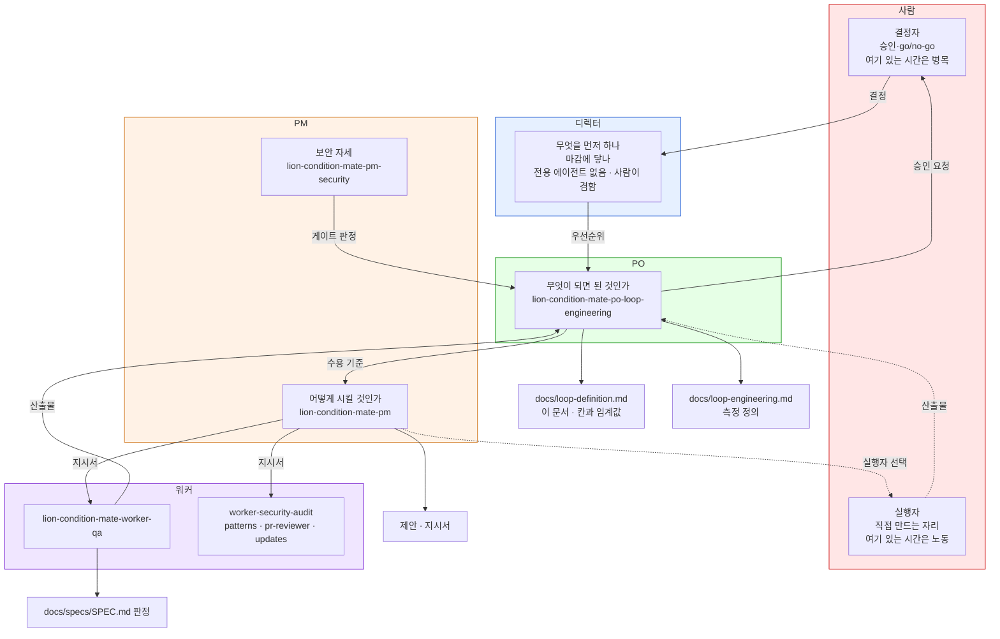
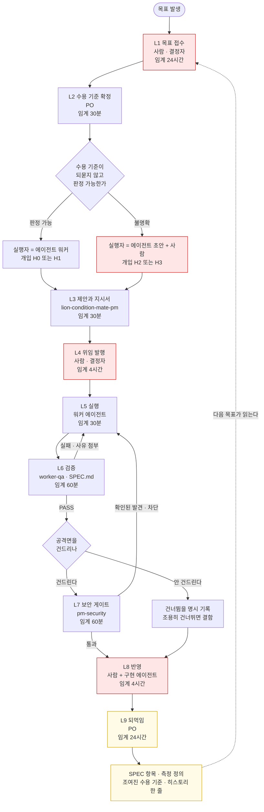
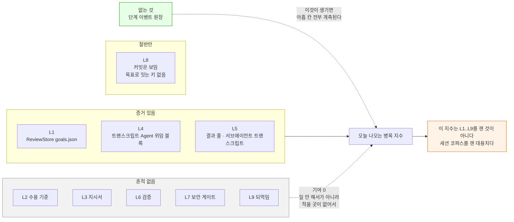

# LOOP DEFINITION — Condition Mate 루프 정의

작성: 2026-08-24 KST
소유: `lion-condition-mate-po-loop-engineering` (이 문서 단독 소유)
지위: **이 문서가 Condition Mate 루프의 공식 정의다.** 칸을 늘리거나 줄이는 권한은 이 문서의 소유자에게만 있다.
관련: `docs/loop-engineering.md` (측정 정의와 화면이 세는 것), `docs/loop-engineering-proposal.md` (2026-08-23 조사)
참조 모델: `projects/org-globalmpc/globalmpc-marketing/agent-ops/PIPELINE.md`, 같은 폴더의 `LOOP_DIAGRAM.md`, `HUMAN_BOTTLENECK.md`

---

## 한 눈에 (원시인 버전)

루프는 아홉 칸이다. L1부터 L9까지.
칸이 끝나면 원장에 한 줄 적어야 한다.
그런데 원장이 없다. 그래서 아홉 칸 중 다섯 칸은 흔적이 하나도 없다.
L4와 L5는 위임 기록에서 캘 수 있다. L1은 goal 상태에서 캘 수 있다. L8은 커밋은 보이는데 어느 목표의 커밋인지 모른다.
L2, L3, L6, L7, L9는 아무도 아무것도 안 남긴다.
그래서 지금 나오는 병목 숫자는 이 루프를 잰 것이 아니다. 세션 전체를 잰 것이다.
L9가 없으면 이것은 루프가 아니라 직선이다.
고칠 것 하나. 단계 이벤트 원장을 만들고, 사람이 아니라 코드가 그 줄을 쓰게 한다.

---

## 0. 이 문서가 존재하는 이유

2026-08-23까지 아홉 칸 정의는 에이전트 프롬프트 파일 하나 안에만 있었다(`.claude/agents/lion-condition-mate-po-loop-engineering.md`의 "The Condition Mate loop, stage by stage" 절). 프롬프트는 에이전트가 읽을 때만 존재하는 정의다. 화면이 참조할 수 없고, QA가 회귀 테스트로 잡을 수 없고, 사람이 열어서 반박할 수도 없다.

정의를 저장소로 옮기면 세 가지가 가능해진다. 화면이 칸 이름과 임계값을 이 문서에서 가져올 수 있다. QA가 "화면의 칸 목록이 이 문서와 같은가"를 회귀로 검증할 수 있다. 그리고 정의가 바뀔 때 git 이력에 남는다.

정의가 두 벌이 되면 끊김 판정 자체가 무의미해진다. 두 번의 측정이 서로 다른 것을 세게 되기 때문이다. 그래서 프롬프트와 이 문서가 어긋나면 **이 문서가 이긴다.**

**승격은 완료되었다.** 2026-08-24 확인 결과 `.claude/agents/lion-condition-mate-po-loop-engineering.md`의 인라인 아홉 칸 목록은 제거되었고, 93행이 이 문서를 유일한 출처로 가리킨다. 즉 아홉 칸의 정의는 이제 이 파일에만 있다. 두 벌이 아니게 되었다는 뜻이고, 동시에 **여기 적힌 내용이 틀리면 그것을 바로잡아 줄 두 번째 사본이 없다는 뜻이기도 하다.** 이 문서의 사실관계에 대한 책임은 전적으로 소유자에게 있다.

---

## 1. 먼저 말할 것 — 아홉 칸 중 다섯 칸은 오늘 흔적이 없다

이 절을 문서 끝이 아니라 정의 바로 앞에 둔다. 정의를 다 읽고 나서야 "그런데 측정이 안 됩니다"를 만나면, 읽는 사람은 이미 아홉 칸이 돌아가고 있다고 믿은 뒤다.

디스크를 직접 확인한 결과다.

**증거가 있는 칸은 셋이다.** L4 위임 발행과 L5 실행은 세션 트랜스크립트의 `Agent` 위임 블록과 결과 줄에서 유도할 수 있다(`Sources/ConditionMate/Core/LoopScan.swift`의 `hops()`). L1 목표 접수는 `ReviewStore`의 goal 레코드에서 유도할 수 있다(goal 816건, `~/.condition-mate/review/goals.json`).

**증거를 찾을 때 쓰는 문자열을 여기 못 박는다. 위임 도구의 이름은 `Task`가 아니라 `Agent`다.** 2026-08-24 KST 전체 코퍼스 실측으로 `"name":"Task"`는 **0건**이고 `"name":"Agent"`는 **129건**이다. 문자열로 훑든 `tool_use` 블록을 파싱하든 같은 값이 나온다. 이 문서를 따라 증거를 찾으려는 사람이 Task로 grep하면 아무것도 못 찾고, 그 0건을 "위임이 한 번도 없었다"로 읽는다. **일하지 않은 것과 기록하지 않은 것을 구분하는 것이 이 문서의 존재 이유이므로, 거짓 0을 만드는 오기는 이 문서가 저지를 수 있는 최악의 오류다.** 이전 판의 이 문서는 다섯 군데에서 Task라고 적고 있었고 정정했다.

129건의 위치도 함께 남긴다. 최상위 세션 파일에 114건, 다른 서브에이전트 트랜스크립트 안에 15건이다. 뒤의 15건이 중첩 위임이며, 한 겹만 훑는 스캔에는 보이지 않는다.

**절반만 있는 칸이 하나다.** L8 반영은 git에 커밋이 남지만, 그 커밋을 어느 목표로 되돌려 잇는 키가 없다. 2026-08-01 이후 커밋 6건 중 goal id나 seq를 언급한 것은 0건이다. goal 816건 중 `links` 필드가 채워진 것은 0건, `evidence`는 3건이다. 즉 커밋이 있었다는 사실은 알 수 있으나 "이 목표가 반영되었다"는 판정은 못 한다.

**흔적이 아예 없는 칸이 다섯이다.** L2 수용 기준 확정, L3 제안과 지시서, L6 검증, L7 보안 게이트, L9 되먹임. 이 다섯 칸은 완료를 기록하는 장소가 정의되어 있지 않다. 파일도 없고 필드도 없다.

여기서 반드시 구분해야 하는 것이 있다. **일하지 않은 것과 기록하지 않은 것은 다르며, 계측기는 둘을 구분하지 못한다.** L2와 L3은 오늘 실제로 수행되었다. 이 문서 자체가 L2의 산출물이고, `docs/loop-engineering-proposal.md`가 L3의 산출물이다. 그런데 어느 계측기도 그 사실을 0분이 아닌 값으로 잡지 못한다. 다섯 칸이 비어 있다는 것은 다섯 칸이 논다는 뜻이 아니라 **다섯 칸에 기록 장소가 없다**는 뜻이다. 결함은 게으름이 아니라 부재하는 증거 쪽에 있다.

---

## 2. 아홉 칸

각 칸은 ID, 이름, 담당, 완료 조건, 정체 임계값, 그리고 오늘의 증거 상태를 갖는다.

**정체 임계값은 소요 시간 예측이 아니다.** 그 칸이 얼마나 걸려야 한다는 말이 아니라, 그만큼 머물러 있으면 경보를 울리라는 값이다. 이 구분을 지키지 않으면 임계값이 곧 목표 시간으로 오해되고, 담당을 재촉하는 도구가 된다.

### L1 목표 접수

무엇인가. 목표가 앱에 들어온다.
담당은 사람이며, 결정자 자리다.
완료 조건은 사람이 읽을 수 있는 제목을 가진 목표가 존재하는 것이다. 제목만으로 무엇을 하려는지 알 수 없으면 완료가 아니다.
정체 임계값은 24시간이다. 길게 둔다. 목표가 접수된 뒤 아무도 집어 들지 않은 채 하루쯤 놓여 있는 것은 정상이다.
오늘의 증거는 있다. `Sources/ConditionMate/Core/ReviewStore.swift`의 goal 레코드다. `~/.condition-mate/review/goals.json`에 816건이 있고 상태 분포는 done 679, cancelled 105, backlog 27, waiting 4, in_progress 1이다.
다음 칸은 L2다.

### L2 수용 기준 확정

무엇인가. 그 목표가 무엇이 되면 된 것인지를 못 박는다.
담당은 PO, 즉 `lion-condition-mate-po-loop-engineering`이다.
완료 조건은 목표가 수용 기준을 달고 있고, 그 기준을 검사기나 읽는 사람이 **작성자에게 되묻지 않고** 예 또는 아니오로 판정할 수 있는 것이다. 되물어야 판정되는 기준은 기준이 아니다.
정체 임계값은 30분이다. 에이전트가 담당하는 칸이므로 짧게 둔다. 30분 넘게 안 움직이는 에이전트는 생각 중인 것이 아니라 막힌 것이다.
오늘의 증거는 없다. 수용 기준이 확정되었다는 사실을 적는 장소가 정의되어 있지 않다.
이 칸이 루프 전체에서 지렛대가 가장 긴 칸이다. 뒤따르는 모든 칸에서 사람이 얼마나 손대야 하는지가 여기서 결정되기 때문이다. 6장에서 다시 다룬다.
다음 칸은 L3다.

### L3 제안과 지시서

무엇인가. 어떻게 시킬지를 쓴다.
담당은 `lion-condition-mate-pm`이다.
완료 조건은 바로 던질 수 있는 프롬프트나 명세가 존재하고, 그 안에 대상 에이전트 이름과 건드릴 경로와 수용 기준이 모두 적혀 있는 것이다. 셋 중 하나라도 빠지면 완료가 아니다.
정체 임계값은 30분이다.
오늘의 증거는 없다. 지시서 파일이 만들어져도 그것이 L3의 완료라고 선언하는 기록이 없다.
다음 칸은 L4다.

### L4 위임 발행

무엇인가. 실제로 위임을 쏜다.
담당은 오늘 기준 사람이다.
완료 조건은 지목된 에이전트를 부르는 `Agent` 도구 호출 블록이 세션 트랜스크립트에 나타나는 것이다. 도구 이름은 `Task`가 아니다. 1장의 실측을 보라.
정체 임계값은 4시간이다. 사람이 담당하는 칸이므로 길게 둔다. 사람은 상시 대기 인력이 아니다.
오늘의 증거는 있다. `LoopScan.hops()`가 세션 트랜스크립트에서 `Agent` 위임 블록을 뽑는다. 실행 중인 대시보드의 `/api/loop-engineering`은 위임 92건, 끊김 5건, 루트 49개를 보고한다.
이 칸이 사람 자리인 것은 누가 그렇게 설계해서가 아니라 **다른 어떤 것도 이 칸을 시작시키지 않기 때문**이다. 이것은 상시 병목 후보이지 결정된 구조가 아니다.
다음 칸은 L5다.

### L5 실행

무엇인가. 워커가 한 방에 만든다.
담당은 L3이 지목한 워커 에이전트다.
완료 조건은 그 위임에 대한 결과 줄이 돌아오는 것이다.
정체 임계값은 30분이다. 근거는 실측이다. 서브에이전트 실행 112건의 내부 벽시계 시간은 중앙값 370초, 75분위 648초, 90분위 1,077초, 95분위 1,584초이고 최대는 5,068초다. 30분을 넘긴 것은 112건 중 5건이다. 즉 30분 임계는 상위 4퍼센트만 경보로 걸러낸다.
오늘의 증거는 있다. 다만 결과가 네 가지로 끝나며 그중 하나만 시간을 잴 수 있다. 3장에서 다룬다.
다음 칸은 L6다.

### L6 검증

무엇인가. 만들어진 것이 명세를 만족하는지 본다.
담당은 `lion-condition-mate-worker-qa`이며 기준 문서는 `docs/specs/SPEC.md`다.
완료 조건은 SPEC 항목에 대해 PASS 또는 이름 붙은 실패가 기록되는 것이다. "대체로 잘 됨"은 완료가 아니다. 어느 SPEC 항목인지와 판정이 함께 있어야 한다.
정체 임계값은 60분이다. 에이전트 칸이지만 회귀 실행이 붙을 수 있어 L2, L3보다 길게 둔다.
오늘의 증거는 없다.
실패하면 사유를 붙여 L5로 되돌린다. 되돌린 기록을 지우지 않는다.
다음 칸은 L7이다.

### L7 보안 게이트

무엇인가. 공격면을 건드렸는지 보고 통과시키거나 막는다.
담당은 `lion-condition-mate-pm-security`다.
완료 조건은 변경이 통과 판정을 받거나, 확인된 발견이 변경을 막는 것이다.
정체 임계값은 60분이다.
이 칸은 공격면을 전혀 건드리지 않는 변경에 한해 건너뛸 수 있다. 다만 **건너뛴다는 사실을 명시적으로 적어야 한다.** 조용히 건너뛴 게이트는 체류 시간과 무관하게 결함이다. 게이트가 빠진 빠른 루프는 빠른 루프가 아니다.
오늘의 증거는 없다.
실패하면 사유를 붙여 L5로 되돌린다.
다음 칸은 L8이다.

### L8 반영

무엇인가. 변경이 실제로 들어간다.
담당은 사람과 구현 에이전트가 함께다.
완료 조건은 변경이 커밋되거나 병합되었고 그 커밋을 특정할 수 있는 것이다.
정체 임계값은 4시간이다. 사람이 걸린 칸이므로 길게 둔다.
오늘의 증거는 절반만 있다. 커밋은 git에 있으나 커밋을 목표로 되돌려 잇는 키가 없다. 앞의 1장에 실측을 적었다. 참고로 goal에 `branch` 필드가 있고 41건이 채워져 있으나, 브랜치는 목표 하나에 대응하지 않으므로 조인 키로 쓸 수 없다.
다음 칸은 L9다.

### L9 되먹임

무엇인가. 이번 판에서 나온 것을 다음 판이 읽는 자리에 되돌려 적는다.
담당은 PO다.
완료 조건은 결과가 다음 목표가 읽는 무언가에 기록되는 것이다. SPEC 항목, `docs/loop-engineering.md`의 항목, 조여진 수용 기준, 또는 루프 히스토리 한 줄 중 하나여야 한다. 회고를 어딘가에 적어두는 것만으로는 완료가 아니다. **다음 판이 그것을 읽는 경로가 있어야 완료다.**
정체 임계값은 24시간이다. 가장 길게 둔다. 결과 데이터가 쌓이는 데 시간이 걸린다.
오늘의 증거는 없다.
다음 칸은 없다. L9는 L1을 가리킨다.

**L9가 없으면 이것은 루프가 아니라 직선이다.** 직선은 개선되지 않는다. 배운 것이 다음 판으로 실려가지 않기 때문이다.

### 되돌림과 세 번 규칙

실패 간선은 루프의 일부이며 기록되어야 한다. 조용히 재시도하지 않는다. 되돌아간 경우에도 이전 줄을 남기고 새 줄을 추가한다. 그래야 어느 칸에서 반복적으로 막히는지가 뭉개지지 않고 보인다.

같은 칸에서 세 번 이상 끊기면 그것은 개별 사건이 아니라 구조 문제다. 그 칸의 담당이나 완료 조건이나 선행 조건을 바꿔야 한다. 담당에게 더 잘해보라고 말하는 것으로 닫지 않는다.

---

## 3. 위임이 끝나는 네 가지 방식

L5의 완료 판정은 이 분류를 따른다. 앱이 이미 이렇게 나눈다.

완료다. 결과가 돌아왔다. **네 가지 중 이것만 소요 시간이 의미를 갖는다.** 위임 시각부터 결과 시각까지다.

백그라운드다. 돌아온 결과 줄은 무언가를 띄웠다는 영수증이지 일이 끝났다는 기록이 아니다. **이 시간은 어떤 합계에도 더하지 않는다.** 시간으로 세면 몇 분짜리 작업이 2초로 둔갑한다.

끊김이다. 위임이 런타임이 모르는 이름을 불렀다. 거의 즉시 실패하고 아무 일도 일어나지 않는다. 끊김을 보고할 때는 그 시점에 정의 파일이 디스크에 있었는지를 함께 말해야 한다. 세션 시작 이후에 저장된 정의는 그 세션에 보이지 않으며, 이것은 파일을 다시 고쳐서가 아니라 새 세션을 열어서 해결된다.

결과 없음이다. 위임은 나갔는데 결과 줄이 끝내 나타나지 않았다.

---

## 4. 다이어그램

### 4-1. 액터와 소유 — 누가 무엇을 갖고 있나

점선 두 개가 핵심이다. PM의 지시서가 에이전트 워커로도 가고 사람 실행자로도 간다. 사람이 승인자 자리에만 있지 않게 하는 갈래다. 사람이 실행자 자리에 들어오면 그때 사람은 병목이 아니라 일꾼이며, 그 시간은 병목 지수에 들어가서는 안 된다. 오늘은 들어간다. 5장에서 다룬다.

디렉터 상자가 사람을 겸하고 있다는 점도 그림에 남긴다. 이 워크스페이스에 condition-mate 디렉터 에이전트는 없다.

### 4-2. L1부터 L9까지 — 되돌림 간선과 갈래 포함

붉은 칸이 사람이 서 있는 자리다. L1, L4, L8은 게이트고, MIX 갈래는 사람이 워커 자리에 들어오는 경로다.

되돌림 간선이 둘이다. L6의 실패와 L7의 차단은 모두 L5로 돌아가며 사유를 달고 간다. **뒤로 보낼 수 있는 칸이 있다는 것이 루프의 요점이다.** 이 두 간선을 빼고 그리면 그것은 루프 그림이 아니라 직선 그림이다.

갈래가 둘이다. L2 뒤의 갈래는 수용 기준의 명확도에 따라 사람 개입 강도를 가른다. L6 뒤의 갈래는 공격면 여부로 L7을 태울지 정하며, 건너뛰는 쪽도 칸으로 그렸다. 건너뜀이 기록되지 않으면 그림에서 사라지고, 사라진 게이트는 없는 게이트이기 때문이다.

노란 칸이 루프를 닫는 지점이다. L9와 그 산출물이 L1로 돌아가는 점선이 없으면 이것은 직선이다.

### 4-3. 오늘 실제로 계측되는 구간

---

## 5. 측정 규칙

### 5-1. 두 가지 양

**가동.** 기록된 한 단계 이벤트와 다음 이벤트 사이의 구간이다.

**대기.** 마지막으로 기록된 이벤트가 최종 칸이 아닌 아이템에 대해, 그 마지막 이벤트부터 지금까지의 구간이다. 마지막 이벤트가 L9인 아이템은 대기를 만들지 않는다. 더 기다릴 것이 남아 있지 않기 때문이다.

### 5-2. 누구에게 다는가 — 앞 칸과 뒤 칸이라는 말을 쓰지 않는다

"앞 칸에 단다"와 "뒤 칸에 단다"는 한국어에서도 영어에서도 반대로 읽힐 수 있다. 이 문서의 소유자로서 그 표현을 버리고 규칙 하나와 예시로 못 박는다.

**규칙: 어떤 구간이든 그 구간 동안 움직여야 했던 칸의 담당에게 단다.**

이벤트는 칸을 **끝냈을 때** 적는다. 따라서 L2 완료 이벤트와 L3 완료 이벤트 사이의 구간은 L3이 일한 시간이며, L3의 담당인 `lion-condition-mate-pm`의 가동으로 단다. 아이템의 첫 이벤트는 가동을 만들지 않는다. 그 앞에 잰 구간이 없기 때문이다.

마지막 이벤트가 L4 완료이고 그 뒤로 아무것도 없다면, L4 완료부터 지금까지는 L5가 움직였어야 하는 구간이다. 따라서 L5의 담당인 워커의 대기로 단다.

두 경우 모두 같은 한 문장으로 설명된다. 구간의 주인은 그 구간에 책임이 있던 칸이다.

### 5-3. 사람 병목 지수

사람에게 달린 대기를, 모든 담당의 가동과 대기를 전부 합한 값으로 나눈다. 소수점 한 자리 백분율로 적는다.

**분모는 루프 전체이지 사람 몫이 아니다.** 이것을 틀리면 지수가 항상 100에 가깝게 나온다.

백분율만 적지 않는다. 분자와 분모의 원값을 옆에 같이 적는다. 백분율만 있으면 표본이 얼마나 얇은지가 숨는다.

### 5-4. 상한 정책 — 사용자가 정한 것

단일 사람 공백에 **4시간 상한**을 건다. 이것은 관측 사실이 아니라 **정책 선택**이며 사용자가 정했다. 상한이 필요한 이유는 사람이 상시 대기 인력이 아니기 때문이다. 잠자는 8시간을 그대로 대기로 세면 지수는 사람의 응답성이 아니라 밤의 길이를 재게 된다.

상한을 어디에 두느냐로 값이 갈린다는 사실을 함께 남긴다. 같은 데이터가 상한 없이는 더 높게, 1시간 상한에서는 더 낮게 나온다.

### 5-5. 오늘의 실측값과, 발표된 값과의 차이

2026-08-24 KST 재측정 결과다. 방법은 다음과 같다. 최상위 세션 트랜스크립트에서 "어시스턴트의 마지막 출력에서 다음 사람 프롬프트까지"의 간격을 사람 대기로 잡는다. 사람 프롬프트는 `type`이 user이면서 `tool_result`를 담지 않고 `isMeta`가 아닌 줄이다. 에이전트 가동은 `~/.claude/projects/<slug>/<sessionId>/subagents/` 아래 서브에이전트 트랜스크립트의 내부 벽시계 시간 합계로 잡는다.

**권위 있는 값 — 파일 선택자를 "세션 시작 시각이 창 안"으로 둔 경우.** 대상 파일 576개, 사람 턴 978회. 사람 대기는 4시간 상한에서 327.3시간이고 에이전트 가동은 14.7시간이다. 사람 병목 지수는 327.3 나누기 342.0으로 **95.7퍼센트**다. 같은 데이터가 상한 없이는 98.6퍼센트, 1시간 상한에서는 92.4퍼센트다.

**발표되었던 값과 왜 다른가.** `docs/loop-engineering-proposal.md` 3-2절은 사람 대기 393.4시간, 에이전트 가동 12.1시간, 4시간 상한 기준 97.0퍼센트를 적었다. 재현을 시도한 결과 **파일 선택자가 달랐다.** 그쪽은 "세션 시작 시각"이 아니라 "파일 수정 시각"으로 창을 잘랐다. 수정 시각으로 자르면 대상 파일이 737개가 되어 그쪽이 적은 735개와 사실상 일치하고, 4시간 상한 사람 대기는 385.2시간이 되며, 그쪽의 가동 12.1시간을 그대로 쓰면 지수가 정확히 97.0퍼센트로 재현된다.

**수정 시각 선택자는 결함이다.** 8월 1일 이전에 시작된 세션이 8월에 한 번 건드려지기만 해도 창 안으로 들어오고, 7월에 벌어진 공백이 8월 창의 분자에 실린다. 그래서 분자가 부풀고 지수가 높게 나온다. 앞으로는 **세션 시작 시각 기준을 쓴다.** 발표된 97.0퍼센트는 폐기된 선택자로 계산된 값으로 기록한다.

**재현되지 않는 값이 하나 있다.** "1시간 상한에서 96.0퍼센트"라는 수치는 어떤 조합으로도 재현되지 않았다. 발표된 자체 수치인 251.5시간과 12.1시간으로 계산하면 95.4퍼센트가 나오고, 폐기된 선택자로 재측정하면 94.5퍼센트, 권위 있는 선택자로는 92.4퍼센트다. 96.0퍼센트는 유도 경로가 없다. **이 수치는 인용하지 않는다.**

### 5-6. 가장 중요한 단서 — 이 지수는 이 루프를 잰 것이 아니다

위의 어떤 숫자도 L1부터 L9까지를 잰 값이 아니다. 단계 이벤트 원장이 없기 때문에 잴 수가 없다. 지금 재고 있는 것은 세션 트랜스크립트 코퍼스 전체이며, 사람 대기는 "대화에서 사람이 다음 말을 하기까지의 공백"이고 에이전트 가동은 "서브에이전트가 돈 벽시계 시간"이다.

이것은 루프 병목의 **대용치**다. 방향은 맞을 것이다. 그러나 "L4에서 몇 분 막혔다"는 문장은 오늘 이 숫자로 뒷받침되지 않는다. 화면이나 보고서가 이 지수를 칸별로 쪼개서 보여준다면 그것은 없는 데이터를 그린 것이다.

### 5-7. 승인 대기열

사람의 결정에 막혀 있는 항목의 목록이다. 각 항목은 무엇을 막고 있는지와 얼마나 기다렸는지를 함께 갖는다. 그 체류는 사람의 대기에 더해진다. 체류 내림차순으로 정렬한다. 가장 오래된 항목이 이 큐가 실제로 무엇을 위한 큐인지를 말해준다.

오늘 실측으로 `waiting` 상태 goal은 4건이며 모두 `waitKind`가 decision이다. 체류는 각각 약 52분, 51분, 26분, 1분 미만이다(2026-08-24 01:28 KST 기준). 이 4건은 `ReviewStore`가 이미 계측하고 있는 유일한 실제 대기 큐다.

### 5-8. 건너뛴 칸

체류 시간과 무관하게 결함으로 표시한다. 칸을 건너뛰었다는 것은 게이트가 작동하지 않았다는 뜻이다. L7만이 명시적 기록을 조건으로 건너뛸 수 있으며, 나머지 여덟 칸에는 건너뜀이 없다.

### 5-9. 단면과 추세를 섞지 않는다

현재 판독값은 매 측정마다 덮어쓴다. 한눈에 읽히는 것이 그 파일의 존재 이유이며 이력을 쌓으면 그 목적이 무너진다.

히스토리는 JSONL이며 한 줄이 추가된다. 지우지 않고 고치지 않는다. 덮어쓰면 개선이 실제로 있었는지를 영원히 증명할 수 없다.

히스토리 한 줄은 최소한 시각, 파싱한 단계 이벤트 수, 관측 구간, 담당별 가동, 담당별 대기, 두 합계, 사람 병목 지수, 열린 대기 각각의 칸과 담당과 체류와 임계와 정체 플래그, 열린 승인 건수, 그 체류 합계를 갖는다. 승인 건별 상세는 현재 판독값에 두고 히스토리에는 두지 않는다.

---

## 6. 사람 개입 강도와 회수

개입에는 네 단이 있고, 어느 단에 떨어지는지는 한 가지가 결정한다. 넘길 때 수용 기준이 얼마나 명확했는가다.

H0은 개입 없음이다. 자동 게이트가 통과하고 일이 진행된다.
H1은 승인만이다. 사람이 예 또는 아니오만 말한다.
H2는 편집이다. 사람이 산출물을 고친다. 품질은 오르고 사람 시간이 든다.
H3은 왕복이다. 사람과 에이전트가 오가며 수렴한다.

단은 그 일의 성숙도를 재는 눈금이지 누구에 대한 평가가 아니다.

강도는 **회수**로만 내려간다. 사람이 H2나 H3에서 고친 내용이 수용 기준으로 돌아가서, 다음 지시서가 이미 그것을 담고 있게 만드는 일이다. 회수하지 않으면 다음 판에 같은 것을 또 고치고, 사람 부하는 그대로이며, 품질도 제자리다.

**회수가 L9의 실질적인 내용이며 L9가 존재하는 주된 이유다.**

목표는 사람 개입 0이 아니다. 목표는 사람이 한 번 앉았을 때 처리되는 건수를 늘리고, 사람이 앉아 있지 않아도 흐르는 구간을 늘리는 것이다. 병목 지수만 따로 읽지 않는다. 승인 대기열의 최장 체류, 큐에 애초에 올라오지 말았어야 할 설정 결함이 섞여 있는지, 세 번 이상 끊긴 칸이 있는지를 함께 읽는다.

---

## 7. ReviewStore 상태 기계와의 관계

`Sources/ConditionMate/Core/ReviewStore.swift:542`에 여섯 상태가 이미 구현되어 있다. `backlog`, `in_progress`, `waiting`, `stopped`, `cancelled`, `done`이다. `waiting`은 `waitingSince`(같은 파일 29행)와 `waitKind`(35행, 값은 permission 또는 decision)를 함께 들고 있다.

두 벌의 어휘가 생겼으므로 어느 쪽이 무엇에 대해 권위를 갖는지 못 박는다.

**둘은 경쟁하는 정의가 아니라 축이 다르다.** L1부터 L9는 **어느 칸까지 갔는가**를 말하고, 여섯 상태는 **그 아이템이 지금 살아 있는가 멈췄는가**를 말한다. 진행 축과 생사 축이다. 한 아이템은 두 값을 동시에 갖는다. L5까지 갔고 `waiting`일 수 있다.

따라서 다음과 같이 나눈다.

**진행 축은 이 문서가 권위를 갖는다.** 칸의 개수, 이름, 담당, 완료 조건, 정체 임계값은 여기서 정한다. 코드가 칸을 늘리거나 이름을 바꾸면 이 문서와 어긋난 것이며 코드 쪽이 틀린 것이다.

**생사 축은 `ReviewStore`가 권위를 갖는다.** 이유는 두 가지다. 첫째, 이미 구현되어 있고 지금 이 순간에도 값이 들어 있다. 둘째, 그 상태들은 사용자의 조작에 직접 묶여 있다. `stopped`와 `cancelled`는 사용자가 쥔 보류이며 세션 훅이 되살리지 않는다는 규칙이 코드에 명시되어 있다. 문서가 그 위에 평행한 어휘를 새로 만들면 화면과 원장이 서로 다른 말을 하게 된다.

**어긋나는 지점 하나를 분명히 적는다.** 이 문서의 어휘에는 `stopped`와 `cancelled`에 해당하는 칸이 없다. 아홉 칸은 전진과 되돌림만 있고 중단이 없다. 이것은 이 문서의 구멍이며, 메우는 방법은 칸을 늘리는 것이 아니다. **중단은 칸이 아니라 아이템의 상태다.** 단계 이벤트 원장을 만들 때 각 줄에 `status`를 함께 적어 `ReviewStore`의 여섯 값 중 하나를 담게 한다. 그러면 "L5에 서 있는데 사용자가 중지시킨 것"과 "L5에 서 있는데 그냥 막힌 것"이 구분되고, 전자는 정체로 세지 않게 된다. 이 구분이 없으면 사용자가 의도적으로 세워둔 아이템이 전부 병목으로 집계된다.

**두 번째 어긋남.** `waitKind`는 사람 대기를 permission과 decision 둘로 이미 나눠 놓았다. 이 문서의 사람 자리 구분인 결정자와 실행자와는 다른 축이다. permission과 decision은 둘 다 결정자 자리이며, 실행자 자리를 나타내는 값이 없다. 5장에서 적은 대로 사람이 워커 자리에서 일한 시간이 대기로 잘못 잡히는 결함은 여기서 온다. 해결은 `waitKind`에 값을 더하는 것이 아니라, 단계 이벤트 줄에 실행자가 에이전트인지 사람인지를 적는 필드를 두는 것이다. `waitKind`는 사람을 기다리는 이유를 말하고, 실행자 필드는 그 칸을 누가 실제로 수행했는지를 말한다. 서로 다른 질문이다.

---

## 8. 무엇이 루프를 닫으며, 닫혔다는 것을 무엇으로 증명하나

**닫힌다는 것의 정의.** 한 아이템이 L1부터 L9까지 이벤트를 남겼고, L9가 만들어낸 산출물을 **다음 아이템의 L1 또는 L2가 실제로 읽었을 때** 루프가 한 바퀴 닫힌 것이다. L9를 적기만 하고 아무도 읽지 않으면 닫힌 것이 아니다.

**직선의 정의.** L9 이벤트가 없이 L8에서 멈춘 아이템이다. 반영까지 갔으므로 일은 끝났고 결과물도 있다. 그러나 배운 것이 다음 판으로 실려가지 않았으므로 다음 판은 같은 실수를 반복할 수 있다. 직선은 실패가 아니라 개선되지 않는 성공이다.

**닫혔음을 증명하는 증거.** 다음 셋이 모두 있어야 한다. 첫째, 그 아이템의 L9 이벤트 줄. 둘째, L9가 무엇을 어디에 적었는지를 가리키는 참조. SPEC 항목 번호, 커밋 해시, 또는 조여진 수용 기준의 위치다. 셋째, 뒤이은 아이템의 L1 또는 L2 이벤트가 그 참조를 인용한 것. 셋째가 빠지면 되먹임을 적어두기만 한 것이지 되먹인 것이 아니다.

**오늘의 판정.** Condition Mate 루프는 **한 번도 닫힌 적이 없다.** 강하게 말하지만 정확히는 이렇다. L9 이벤트를 적는 장소 자체가 없으므로 닫힘을 증명할 방법이 없고, 증명할 수 없는 닫힘은 닫힘이 아니다. 오늘까지 이 저장소에서 관측 가능한 가장 긴 경로는 L4에서 L5를 거쳐 L8로 가는 조각이며, 그것도 L8을 목표로 되돌려 잇지 못한다. **이것은 직선이고, 선이 끝나는 칸은 L8이다.**

---

## 9. 이 모든 것을 막고 있는 것 — 단계 이벤트 원장이 없다

### 9-1. 있어야 하는 파일

`~/.condition-mate/ledger/loop-events.jsonl`

이 저장소 안이 아니라 사용자 홈 아래에 두는 이유는 두 가지다. 하나는 이미 같은 자리에 공용 원장 `~/.condition-mate/ledger/agent-update-log.jsonl`이 있어 규약이 같아진다는 것이고, 다른 하나는 브랜치를 옮겨 다녀도 원장이 갈라지지 않는다는 것이다. 원장이 브랜치별로 갈라지면 추세가 무너진다.

### 9-2. 한 줄의 모양

한 줄은 JSON 객체 하나이며, 한 줄이 곧 한 칸의 완료다. 필드는 다음과 같다.

`item`은 아이템 식별자다. 루프 전체에서 같은 값을 유지한다. goal에서 출발한 아이템이면 `goal-<seq>`를 쓴다. 이렇게 두어야 `ReviewStore`와 조인된다.

`stage`는 방금 끝낸 칸의 ID이며 L1부터 L9 중 하나다.

`at`은 완료 시각이며 KST ISO8601로 적는다.

`by`는 담당이다. 에이전트 이름을 그대로 쓰거나 사람이다.

`executor`는 그 칸을 실제로 수행한 주체이며 값은 agent 또는 human이다. 이 필드가 있어야 사람의 시간이 두 종류로 갈린다. 사람을 기다린 시간과 사람이 일한 시간이다. 오늘은 둘 다 대기로 잡혀 병목 지수가 실제보다 높게 나온다.

`result`는 통과 또는 반려 또는 건너뜀 중 하나다.

`status`는 그 시점 아이템의 생사이며 `ReviewStore.validStatuses`의 여섯 값 중 하나다. 7장에서 정한 대로다.

`ref`는 그 칸의 완료를 증명하는 것을 가리킨다. 파일 경로, 커밋 해시, SPEC 항목, 또는 위임의 `toolUseId`다.

`note`는 한 줄 메모다. 반려 사유나 건너뜀 사유를 적는다.

줄을 지우지 않는다. 반려로 되돌아간 경우에도 이전 줄을 남기고 새 줄을 추가한다.

### 9-3. 누가 각 칸에서 쓰는가

L1은 앱이 쓴다. goal이 생성되는 지점에서 코드가 쓴다.
L2는 PO 에이전트가 쓴다.
L3은 `lion-condition-mate-pm`이 쓴다.
L4는 앱이나 훅이 쓴다. 트랜스크립트의 `Agent` 위임 블록에서 유도할 수 있으므로 사람이 쓸 필요가 없다.
L5는 앱이나 훅이 쓴다. 결과 줄에서 유도할 수 있다.
L6은 `lion-condition-mate-worker-qa`가 쓴다.
L7은 `lion-condition-mate-pm-security`가 쓴다.
L8은 git 훅이나 앱이 쓴다.
L9는 PO 에이전트가 쓴다.

### 9-4. 위험을 정면으로 적는다

아홉 칸 중 다섯 칸의 필자가 에이전트다. L2, L3, L6, L7, L9다.

**이 저장소에서 이미 쓰기 규칙이 있는 원장 하나가 어떻게 되었는지를 실측했다.** `~/.condition-mate/ledger/agent-update-log.jsonl`은 50줄이다. 작성자는 세 이름뿐이며 `manager-qa`가 38줄, `manager-pm`이 11줄, `lion-condition-mate-pm`이 1줄이다. 날짜 분포를 보면 49줄이 7월에 몰려 있고, 8월은 21일에 1줄, 23일에 1줄이 전부다. 7월 27일부터 8월 21일까지 25일간 한 줄도 없다.

더 나쁜 것이 있다. `manager-qa`와 `manager-pm`은 **오늘 디스크에 정의 파일이 존재하지 않는다.** `~/.claude/agents`, 각 스킬 하니스, 이 저장소의 `.claude/agents` 어디에도 없다. 즉 50줄 중 49줄이 지금은 사라진 두 이름이 남긴 것이다. 현재 살아 있는 여덟 개의 `lion-condition-mate-*` 에이전트 중 이 원장에 줄을 남긴 것은 하나뿐이고 그것도 어제 한 줄이다.

**결론은 피할 수 없다.** 에이전트에게 "끝나면 한 줄 적어라"라고 프롬프트에 써 두는 방식은 이 Mac에서 이미 실패한 적이 있다. 규율에 의존하는 정의는 영원히 0을 읽는 정의다. 그리고 5장에서 적은 대로 계측기는 일하지 않은 것과 기록하지 않은 것을 구분하지 못하므로, 그 0은 "에이전트가 놀았다"로 읽힌다. 사실이 아닌데도 그렇게 읽힌다.

### 9-5. 규율 대신 무엇을 두어야 하는가

원장이 스스로 채워지게 만드는 순서다. 자동으로 채울 수 있는 칸부터 채우고, 사람과 에이전트의 손을 마지막까지 미룬다.

**첫째, 유도 가능한 네 칸은 코드가 쓴다.** L1은 goal 생성 지점에서, L4와 L5는 트랜스크립트 스캔에서, L8은 커밋에서 나온다. 아홉 칸 중 넷이 아무의 규율도 없이 채워진다. 특히 L4와 L5는 `LoopScan.hops()`가 이미 뽑고 있는 데이터를 원장 모양으로 적기만 하면 된다.

**둘째, 산출물의 존재를 완료로 삼는다.** L2, L3, L6, L9는 각각 산출물이 있다. 수용 기준, 지시서, SPEC 판정, 되먹임 참조다. 에이전트에게 별도로 한 줄 더 쓰라고 하는 대신, **그 산출물 파일이 약속된 자리에 나타나는 것을 감시해서 코드가 줄을 쓴다.** 에이전트가 잊어도 원장은 채워진다. 에이전트가 해야 할 일은 원래 하려던 일을 하는 것뿐이다.

**셋째, 남는 칸에는 부재를 명시적으로 기록한다.** 위 둘로도 자동화되지 않는 칸은 L7 보안 게이트다. 이 칸만은 판정이 사람이나 에이전트의 선언에 의존한다. 그렇다면 규율을 요구하는 대신 **없으면 통과시키지 않는 게이트**로 만든다. L7 줄이 없으면 L8을 완료로 세지 않는다. 원장에 적을 유인이 규율이 아니라 진행 조건이 된다.

**규칙 하나로 요약한다. 원장에 줄을 쓰는 것이 일과 별개의 추가 작업인 한 그 줄은 쓰이지 않는다. 줄이 쓰이지 않으면 일이 안 된 것으로 읽히거나, 다음 칸으로 못 넘어가야 한다. 둘 중 하나가 성립할 때만 원장은 살아남는다.**

### 9-6. 이 항목이 최우선인 이유

이 문서에 적은 아홉 칸의 완료 조건과 임계값은 전부 원장을 전제로 한다. 원장이 없으면 정체 판정도 없고, 칸별 병목도 없고, 세 번 규칙도 발동하지 않고, 5-6절에서 적은 대로 병목 지수는 이 루프가 아닌 다른 것을 계속 잰다. 그리고 추세를 쌓는 히스토리도 만들 수 없다. **움직일 수 없는 숫자는 관리할 수 없다.**

---

## 10. 재지 못하는 축과 그 이유

빈칸으로 두지 않고 이유를 적는다.

**칸별 시간을 못 잰다.** 단계 이벤트 원장이 없기 때문이다. 9장이 그 항목이다. 이것 하나가 나머지 대부분의 원인이다.

**핸드오프 비용은 부분적으로 잴 수 있게 되었다.** 이 문서 이전의 여러 문서와 에이전트 정의는 "서브에이전트의 내부 턴은 트랜스크립트에 한 줄도 남지 않으며 전체에서 0건"이라고 적어 왔다. **디스크를 직접 세어 보니 사실이 아니다.** 2026-08-24 KST 실측으로 `subagents` 폴더가 49개, 서브에이전트 트랜스크립트가 112개, `isSidechain`이 참인 줄이 9,640줄, 내부 어시스턴트 턴이 5,979회, 내부 도구 호출이 3,342회, 내부 벽시계 합계가 18.4시간이다. **이 수치들은 일할 때마다 늘어난다. 인용하기 전에 직접 다시 세라.** 같은 날 앞서 잰 값은 각각 9,198줄과 17.8시간이었고, 이 문서를 고치는 동안에도 올랐다.

**부모 위임과 자식 트랜스크립트의 조인율은 100퍼센트다.** `agent-<id>.meta.json` 112개가 전부 `toolUseId`를 갖고 있고, 112개 전부가 그 값을 발행한 `Agent` 위임 블록에 붙는다. 다만 **어디에 붙는지가 갈린다.** 97개는 최상위 세션 파일의 홉에 붙고, 15개는 다른 서브에이전트 트랜스크립트 안의 홉에 붙는다. 후자가 중첩 위임이다. 세션 폴더를 한 겹만 훑는 스캔은 이 15개의 부모를 찾지 못하므로 조인율이 86.6퍼센트로 보인다. **86.6퍼센트는 데이터의 성질이 아니라 스캔의 성질이다.** 중첩을 세면 전부 붙는다.

못 봤던 이유는 스캔 범위다. `Sources/ConditionMate/Core/LoopScan.swift`의 `hops()`는 세션 폴더를 `contentsOfDirectory`로 한 겹만 훑고 확장자가 jsonl인 것만 거른다. `subagents/` 하위 폴더로 내려가지 않는다. 증거의 부재가 아니라 스캔의 부재였다. 실행 중인 대시보드가 보고하는 가동 4시간과, 서브에이전트 내부 벽시계 합계 18.4시간의 차이가 그 값이다.

다만 **완전히 해결된 것은 아니다.** 잴 수 있게 된 것은 서브에이전트가 내부에서 보낸 시간이지, 그중 얼마가 "앞 홉이 이미 알던 것을 다시 캐느라" 쓴 낭비인지가 아니다. 받은 쪽이 첫 산출을 내기 전에 부른 읽기 도구 호출 수를 대용치로 쓸 수는 있으나, 그것이 재캐기인지 정당한 조사인지는 구분되지 않는다.

**홉 사이의 공유 산출물을 못 잰다.** 어떤 홉이 어떤 파일에 무엇을 썼는지가 구조화된 형태로 기록되지 않는다. 9-2절의 `ref` 필드가 생기면 이 축이 열린다.

**사람의 가동이 대기로 잘못 잡힌다.** 사람이 결정하느라 쓴 시간과 사람이 직접 만드느라 쓴 시간을 구분하는 기록이 없다. 둘 다 대기로 떨어지므로 병목 지수는 실제보다 **높게** 나온다. 지수를 적을 때마다 이 사실과 그 메커니즘을 함께 적는다. 9-2절의 `executor` 필드가 생기면 이 축이 열린다.

**잠자는 시간이 대기로 잡힌다.** 사람은 상시 대기 인력이 아니다. 밤을 가로지르는 구간의 큰 지수는 대부분 밤이다. 5-4절의 4시간 상한이 이것을 부분적으로만 눌러준다.

**가동 0분이 증거 0을 뜻할 수 있다.** L2와 L3이 오늘 그 상태다. 실제로 수행되었는데 0으로 잡힌다.

**`trackedSeconds`를 가동 시간의 근거로 쓸 수 없다.** 세션이 붙지 않은 수동 goal이 `in_progress`로 몇 주씩 놓여 있으면서 값이 부풀었다. 코드 주석도 이 필드가 대기 시간을 절대 포함하지 않는다고 적고 있으나, 문제는 대기가 아니라 방치다. 이 필드를 가동으로 쓰면 화면이 거짓말을 한다.

---

## 11. 이름에 관한 메모

이 도메인의 이름은 루프 엔지니어링이다. 코드는 오랫동안 Orchestration으로 불러 왔고, 이 문서를 쓰는 시점에 이름 변경이 진행 중이다. 디스크에서 확인한 현재 상태는 다음과 같다. `OrchestrationScan.swift`는 `LoopScan.swift`가 되었고 타입 이름은 `LoopScan`이다. `OrchestrationContent.swift`는 `LoopEngineeringContent.swift`가 되었다. 라우트는 `/api/loop-engineering`이며, 이름 변경이 끝난 지금 실행 중인 대시보드는 `/api/loop-engineering`에만 응답한다 — 옛 API `/api/orchestration`은 별칭 없이 404다(전용 분기가 `DashboardServer`에 있다; 없으면 서버의 마지막 else가 대시보드 HTML을 200으로 돌려준다). 옛 페이지 `/orchestration`은 여전히 200으로 살아 있으며 `/loop-engineering`으로 가는 리다이렉트 문서를 돌려준다. 측정 정의 문서 `docs/orchestration-routes.md`는 `docs/loop-engineering.md`가 되었다.

이 문서는 산문에서 도메인 이름을 쓰고, 심볼과 경로와 라우트를 인용할 때는 디스크에 있는 현재 이름을 쓴다. 이름 변경이 진행 중이므로 인용된 심볼 이름은 이 문서의 작성 시점 기준이다.

---

## 12. 이 문서를 바꾸는 방법

칸을 늘리거나 줄이는 것, 담당을 바꾸는 것, 완료 조건을 바꾸는 것, 임계값을 바꾸는 것은 이 문서의 소유자만 한다. 세션마다 칸 목록이 흔들리면 정체 판정 자체가 무의미해진다. 두 번의 측정이 같은 것을 세지 않게 되기 때문이다.

바꿀 때는 이유를 함께 적는다. 특히 같은 칸에서 세 번 이상 끊혀서 구조를 고치는 경우라면, 무엇이 세 번 끊혔는지를 근거로 남긴다.

이 문서가 화면이나 코드와 어긋나면, 진행 축에 관해서는 이 문서가 옳고 코드가 틀린 것이다. 생사 축에 관해서는 7장의 규칙을 따른다.
